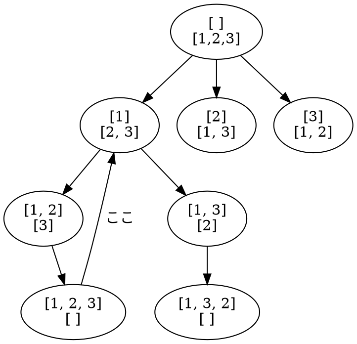

# 組み合わせ

Permutations の列挙

## 私の解答

- 解法: 素直に DFS

早く再帰からループで書けるようになれという気持ち。
今回もノードから戻る際に (図中"ここ" )、スライスで意図しない挙動を起こした(`[3, 3]`になった)のでギブアップ。

## 解答例１

- とりあえずコピーする

`append(left[:i], left[i+1:]...)` のようなコードは必ずバグを発生させている気がするので、分割して 1 つ 1 つ足していくのが無難そう。
